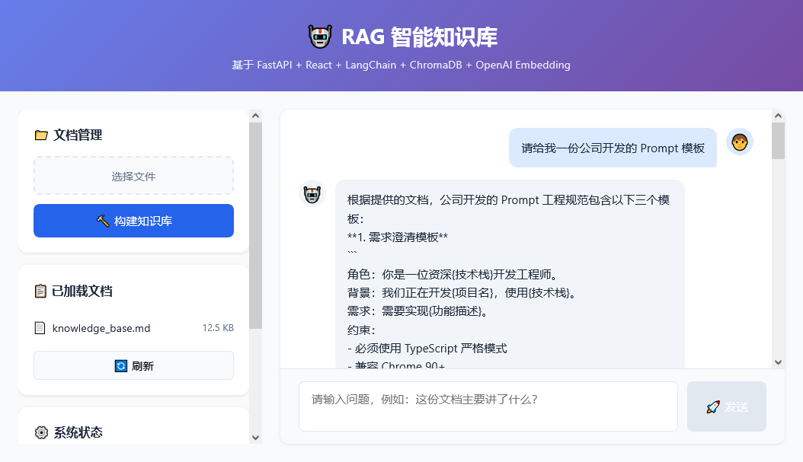

# RAG Knowledge Base — 智能知识库检索系统

基于 **FastAPI + React + LangChain + ChromaDB + OpenAI Embedding** 的前后端分离 RAG 检索增强生成系统，支持多轮对话、文档上传与智能检索。

## 核心特点

- **前后端分离架构**：FastAPI 后端 + React 前端，职责分离，便于开发和扩展
- **RAG 检索增强生成**：基于向量检索从私有文档中提取相关知识，减少 LLM 幻觉
- **多轮对话记忆**：自动维护对话上下文，支持连续追问
- **多文档支持**：支持 PDF、TXT、MD 等格式文档上传
- **模块化架构**：Loader → Splitter → Embedding → VectorStore → Retriever → Chain，清晰可扩展
- **内置示例文档**：提供示例知识库文档，便于快速体验

## 快速开始

### 1. 克隆项目 & 安装依赖

```bash
git clone https://github.com/koen301/RAG-Knowledge-Base.git
cd RAG-Knowledge-Base

# 安装 Python 依赖
pip install -r requirements.txt

# 安装前端依赖
cd frontend
npm install
cd ..
```

### 2. 配置 API Key

```bash
cp .env.example .env
# 编辑 .env，填入你的 API Key
```

### 3. 启动服务

```bash
# 终端1: 启动后端 (端口 8000)
cd src
python -m uvicorn api:app --reload --port 8000

# 终端2: 启动前端 (端口 5173)
cd frontend
npm run dev
```

### 4. 访问

- 前端界面: http://localhost:5173
- API 文档: http://localhost:8000/docs

## 一键启动

项目提供了启动脚本，方便快速启动前后端服务：

```bash
# macOS/Linux
./run.sh

# Windows PowerShell
.\run.ps1
```

或使用分步启动脚本（可同时启动前后端）：

```bash
./start_advanced.sh
```

## 技术栈

### 后端

| 模块 | 技术 |
|------|------|
| Web 框架 | FastAPI |
| LLM 接口 | OpenAI API 兼容层（支持 DeepSeek / 通义千问 / GPT 等） |
| 文档加载 | PyPDFLoader, TextLoader |
| 文本分割 | RecursiveCharacterTextSplitter |
| 向量存储 | ChromaDB |
| 检索链 | ConversationalRetrievalChain |
| 对话记忆 | ConversationBufferMemory |

### 前端

| 模块 | 技术 |
|------|------|
| 框架 | React 18 + TypeScript |
| 构建工具 | Vite |
| 语法高亮 | react-syntax-highlighter |

## API 接口

| 接口 | 方法 | 说明 |
|------|------|------|
| `GET /api/status` | GET | 获取系统状态和知识库统计 |
| `GET /api/documents` | GET | 获取已上传文档列表 |
| `POST /api/upload` | POST | 上传文档构建知识库 |
| `POST /api/chat` | POST | 发送对话消息 |
| `POST /api/clear` | POST | 清空对话历史 |

详细 API 文档请访问 http://localhost:8000/docs

## 项目结构

```
RAG-Knowledge-Base/
├── src/                    # 后端代码
│   ├── api.py              # FastAPI 应用入口
│   ├── app.py              # 原版 Gradio 界面（保留）
│   ├── rag_engine.py       # RAG 引擎核心逻辑
│   ├── config.py           # 配置管理
│   └── data/               # 知识库文档目录
├── frontend/               # 前端代码
│   ├── src/                # React 组件源码
│   │   ├── App.tsx         # 主应用组件
│   │   ├── main.tsx        # 应用入口
│   │   └── index.css       # 全局样式
│   ├── package.json        # 前端依赖配置
│   └── vite.config.ts     # Vite 配置
├── docs/                   # 项目文档
├── requirements.txt        # Python 依赖
├── .env.example            # 环境变量模板
└── README.md
```

## Gradio 原型界面

如需使用 Gradio 原型界面，可通过以下方式启动：

```bash
cd src
python app.py
```

浏览器访问 `http://localhost:7860`

## 截图



