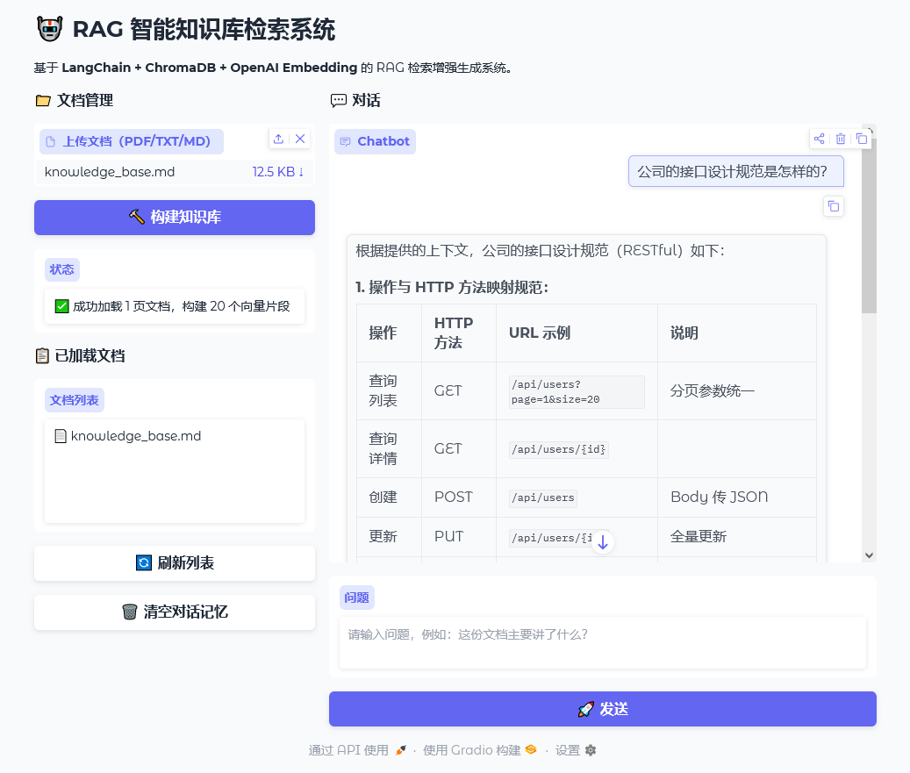

# AI Knowledge Assistant - 个人知识库助手

基于 LangChain + RAG + LLM 的个人知识库问答助手，支持多轮对话、文档上传与智能检索。
> 另有更好的交互体验 **[TypeScript 全栈版本](https://github.com/koen301/AI-Knowledge-Assistant-ts)**

## 项目亮点

- **RAG 检索增强生成**：基于向量检索从私有文档中提取相关知识，减少 LLM 幻觉
- **多轮对话记忆**：自动维护对话上下文，支持连续追问
- **多文档支持**：支持 PDF、TXT、MD 等格式文档上传
- **模块化架构**：Loader → Splitter → Embedding → VectorStore → Retriever → Chain，清晰可扩展
- **一键启动**：Gradio Web 界面，无需配置即可运行

## 快速开始

### 1. 克隆项目 & 安装依赖

```bash
git clone https://github.com/koen301/ai-knowledge-assistant.git
cd ai-knowledge-assistant
pip install -r requirements.txt
```

### 2. 配置 API Key

```bash
cp .env.example .env
# 编辑 .env，填入你的 API Key
```

### 3. 准备文档

将 PDF/TXT/MD 等格式的文档放入 `data/` 目录，或直接通过 Web 界面上传。

### 4. 启动

```bash
python src/app.py
```

浏览器访问 `http://localhost:7860`

## 技术栈

| 模块 | 技术 |
|------|------|
| LLM 接口 | OpenAI API 兼容层（支持 DeepSeek / 通义千问 / GPT 等） |
| 文档加载 | PyPDFLoader, TextLoader |
| 文本分割 | RecursiveCharacterTextSplitter |
| 向量存储 | ChromaDB / FAISS |
| 检索链 | ConversationalRetrievalChain |
| 对话记忆 | ConversationBufferMemory |
| Web 界面 | Gradio |


## 截图


